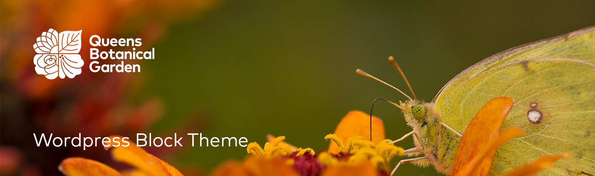

# Queens Botanical Block Theme

Full Site Editing block theme for [Queens Botanical Garden](https://queensbotanical.org/). Global styles live in `theme.json`; layouts and templates are edited in the Site Editor.

## Try it in WordPress Playground

Launch a live demo (theme, plugins, and pages from `_playground/demo-content.xml`):

**[Open demo in Playground →](https://playground.wordpress.net/?blueprint-url=https://raw.githubusercontent.com/azizramos00/qbg/main/_playground/blueprint.json)**

## Plugins (Playground demo)

The Playground blueprint installs and activates these plugins (matching the local QBG stack):

| Plugin | Slug |
|--------|------|
| Create Block Theme | `create-block-theme` |
| The Events Calendar | `the-events-calendar` |
| Spectra (Ultimate Addons for Gutenberg) | `ultimate-addons-for-gutenberg` |
| GTranslate | `gtranslate` |
| We're Open! (Opening Hours) | `opening-hours` |
| WordPress Importer | `wordpress-importer` |

To add or remove plugins, edit the `plugins` array in `_playground/blueprint.json`. Use a [wordpress.org slug](https://wordpress.org/plugins/) or a public zip URL for custom plugins.

## Requirements

- WordPress 6.4+
- PHP 8.1+

## Playground demo content

On each new Playground session, the blueprint imports `_playground/demo-content.xml` (export from Local via **Tools → Export**) and sets the **Home** page (`home-2-2-2`) as the front page.

After updating content on Local, replace `demo-content.xml`, commit, and push. The theme zip does not include this file (it is fetched separately during import).

**Note:** Media URLs in the export still point at `queensbotanical.local`, so images may not load in Playground until those URLs are updated to public paths (e.g. `raw.githubusercontent.com` or your CDN).

## Development

After theme changes, regenerate the Playground zip before pushing:

```bash
_playground/build-theme-zip.sh
```

Commit and push `_playground/queens-botanical-block-theme.zip` along with your other changes so the demo stays in sync.
